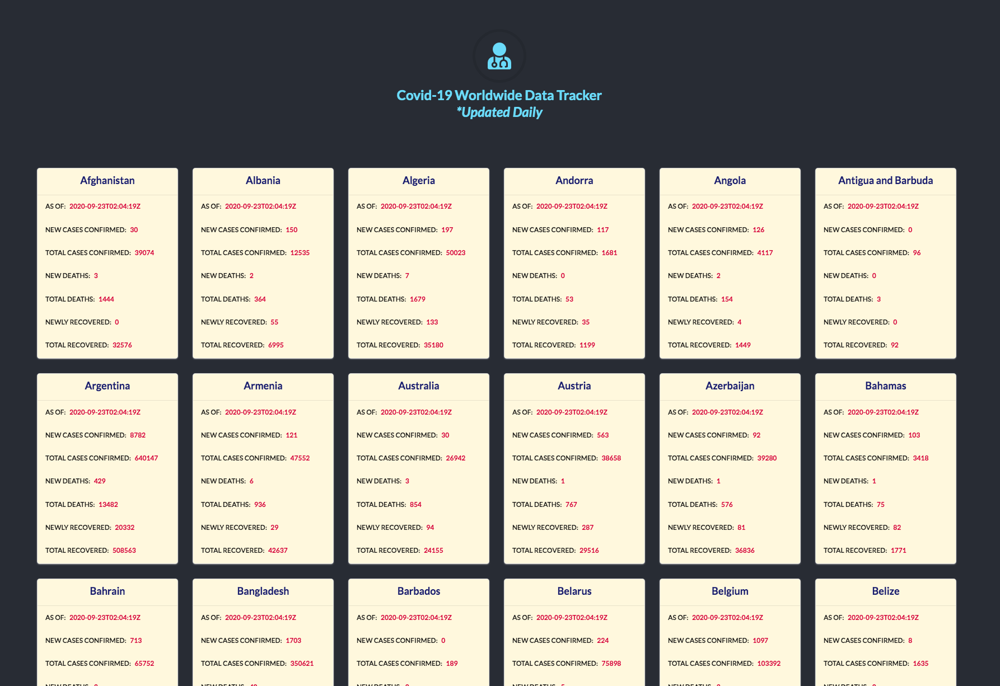

# React-GraphQL App that displays up-to-date Covid-19 data
_________________________
## In this project, Apollo Server is used to fetch data from [covid19api.com](https://covid19api.com/)
______________________________
## NOTE: A CodeSandbox GraphQL layer was created to serve the front-end React portion of this app  which is located at [https://kod79.sse.codesandbox.io/](https://kod79.sse.codesandbox.io/)

### -> You can comment it out in /client-react/src/index.js inside the client variable, however, if you'd like to create a server locally comment OUT the CodeSandbox uri and comment IN the uri below it and continue with the directions below:

## To Open a server locally - In terminal navigate to project root (Apollo Server):
#### -> yarn start
#### -> In browser go to http://localhost:4000/
________________________
## Front-End:
## In terminal navigate to client-react:
#### -> yarn start
#### -> In browser go to http://localhost:3000/

<h4 align="center">App Image</h4>

  

